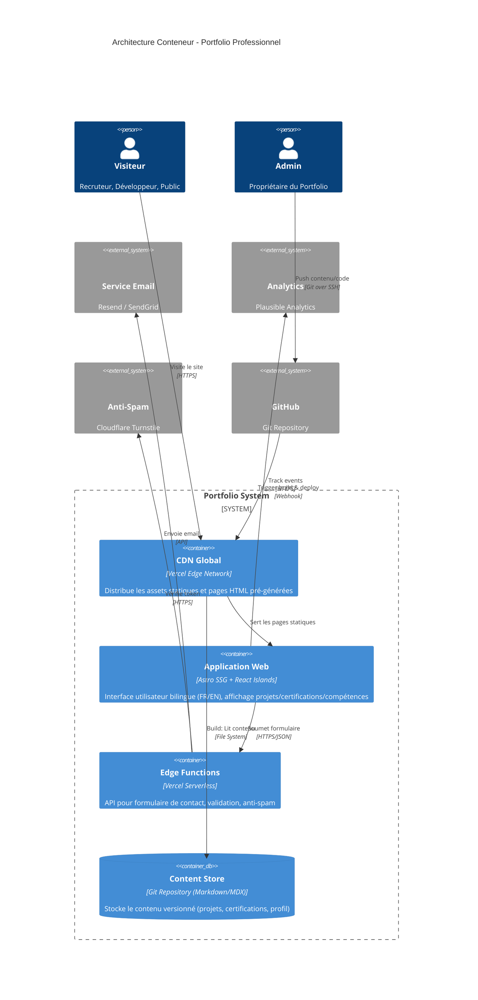
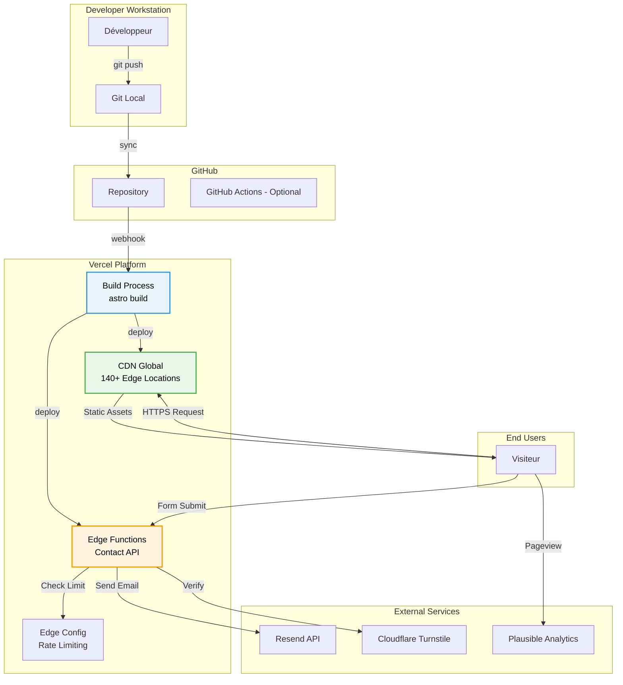
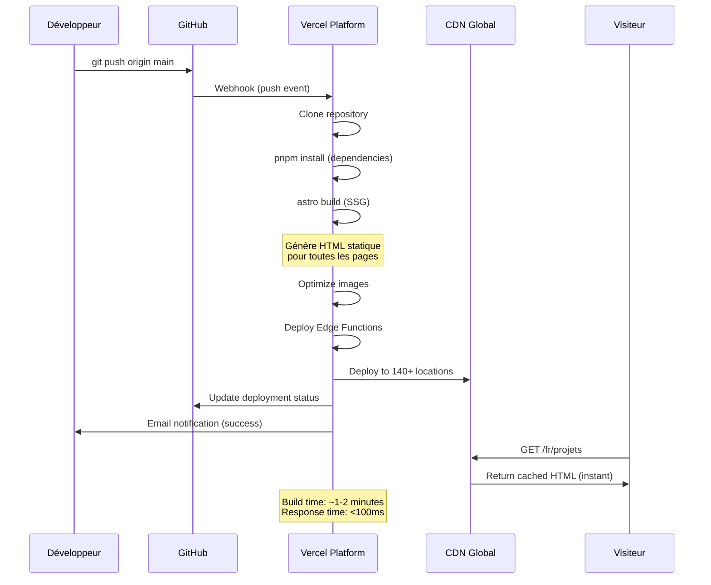

# 01_ARCHITECTURE_TECHNIQUE.md

> **Document d'Architecture Technique & Sécurité**  
> Projet : Portfolio Professionnel d'Ingénieur Informatique  
> Date : 17 janvier 2026  
> Version : 1.0  
> Statut : ✅ **VALIDÉ**

---

## 1. Architecture de Haut Niveau (High-Level Design)

### 1.1 Pattern d'Architecture : **Jamstack Statique avec Edge Functions**

**Décision** : Architecture **Jamstack statique** (Static Site Generation) avec fonctions serverless à la périphérie (Edge Functions).

**Justification par rapport à la Vision** :

Le projet est un **portfolio professionnel MVP** avec les caractéristiques suivantes :

- Contenu quasi-statique (mise à jour mensuelle)
- 15 projets max, 20 certifications max
- Pas d'authentification utilisateur multi-tenant
- KPI critique : **Lighthouse >90**, **<2s FCP**
- Budget : Hébergement gratuit (Vercel)

**Pourquoi PAS Microservices ?**  
❌ Over-engineering : Complexité inutile pour un portfolio  
❌ Coût opérationnel élevé (orchestration, monitoring)  
❌ Latence réseau entre services (impact sur le FCP <2s)  
❌ Pas de scaling horizontal nécessaire (trafic prévisible)

**Pourquoi PAS Monolithe Backend Traditionnel ?**  
❌ Serveur always-on coûteux (infrastructure)  
❌ Temps de réponse serveur > static files sur CDN  
❌ Complexité de déploiement vs. build statique

**Pourquoi Jamstack + Edge Functions ?**  
✅ **Performance native** : HTML pré-généré servi par CDN global (FCP <500ms)  
✅ **Sécurité maximale** : Pas de base de données exposée, surface d'attaque minimale  
✅ **Coût zéro** : Vercel free tier généreux pour portfolio  
✅ **Scalabilité automatique** : CDN + Edge Functions scale sans configuration  
✅ **DX optimale** : Deploy sur git push, preview branches automatiques  
✅ **Serverless pour logique métier** : Formulaire de contact isolé dans une fonction

### 1.2 Diagramme C4 - Niveau Conteneur



**Flux principaux** :

1. **Consultation** (Visiteur) :
   - Requête HTTPS → CDN Vercel (Edge Network)
   - CDN sert HTML pré-généré + assets optimisés
   - JS Islands React hydratent les composants interactifs (filtres, theme toggle)
   - Analytics enregistre la visite (Plausible, sans cookies)

2. **Contact** (Visiteur → Admin) :
   - Soumission formulaire → Edge Function (validation)
   - Edge Function → Turnstile (vérification anti-spam)
   - Edge Function → Resend/SendGrid (envoi email)
   - Réponse synchrone au visiteur (confirmation)

3. **Mise à jour Contenu** (Admin) :
   - Admin modifie Markdown dans Git → Push GitHub
   - GitHub Webhook → Vercel Build
   - Vercel : `astro build` → Génère HTML statique
   - Déploiement automatique sur CDN global (~1-2 min)

---

## 2. Stack Technique Détaillée

### 2.1 Frontend

| Composant      | Technologie     | Version      | Justification                                                         |
| -------------- | --------------- | ------------ | --------------------------------------------------------------------- |
| **Framework**  | Astro           | 4.x          | SSG avec Islands Architecture, Zero JS par défaut, support MDX natif  |
| **UI Library** | React           | 18.x         | Composants interactifs uniquement (formulaire, filtres, theme toggle) |
| **Styling**    | Tailwind CSS    | 3.x          | Utility-first, PurgeCSS intégré, design tokens, DX rapide             |
| **Language**   | TypeScript      | 5.x (Strict) | Type safety, meilleure DX, documentation vivante                      |
| **i18n**       | astro-i18next   | 1.x          | Standard Astro pour i18n, support routes localisées                   |
| **Forms**      | React Hook Form | 7.x          | Validation performante, DX optimale                                   |
| **Validation** | Zod             | 3.x          | Type-safe validation, intégration TypeScript                          |
| **Icons**      | Lucide React    | Latest       | Icons modernes, tree-shakeable                                        |
| **Animations** | Tailwind + CSS  | Native       | Micro-interactions légères, pas de lib JS lourde                      |

**Package Manager** : pnpm (performance, workspace monorepo-ready)

### 2.2 Backend / Edge

| Composant         | Technologie                            | Justification                                         |
| ----------------- | -------------------------------------- | ----------------------------------------------------- |
| **Runtime**       | Vercel Edge Functions                  | Serverless, cold start <50ms, déploiement automatique |
| **API Contact**   | TypeScript                             | Type-safe, code partagé avec frontend                 |
| **Email Service** | Resend (primary) / SendGrid (fallback) | API moderne, templates, logs, délivrabilité élevée    |
| **Anti-Spam**     | Cloudflare Turnstile                   | Gratuit, privacy-friendly, remplacement reCAPTCHA     |
| **Rate Limiting** | Vercel Edge Middleware                 | Protection native contre abus API                     |

**Pas de base de données** : Contenu 100% statique (Markdown/MDX dans Git)

### 2.3 Infrastructure & DevOps

| Composant           | Technologie                  | Justification                                                      |
| ------------------- | ---------------------------- | ------------------------------------------------------------------ |
| **Hosting**         | Vercel                       | CDN global, Edge Functions, preview deployments, analytics intégré |
| **DNS**             | Vercel DNS / Cloudflare      | Gestion simplifiée, DNSSEC, DDoS protection                        |
| **CI/CD**           | Vercel (intégré)             | Deploy sur git push, preview branches automatiques                 |
| **Version Control** | GitHub                       | Source de vérité, workflows, issues                                |
| **Content Source**  | Git (Markdown/MDX)           | Versionning, review process, aucune infra additionnelle            |
| **Analytics**       | Plausible Analytics          | RGPD-compliant, privacy-first, <1KB, pas de cookies                |
| **Monitoring**      | Vercel Analytics + Logs      | Uptime, performance, erreurs Edge Functions                        |
| **Secrets**         | Vercel Environment Variables | API keys sécurisées, différenciation env (dev/prod)                |

**Pas de Docker/Kubernetes** : Inutile pour Jamstack statique (Vercel gère l'infrastructure)

### 2.4 Outils de Développement

| Outil             | Usage                            |
| ----------------- | -------------------------------- | ------------------------------------------------- |
| **IDE**           | VS Code                          | Avec extensions Astro, Tailwind, ESLint, Prettier |
| **Linting**       | ESLint + Prettier                | Code quality, formatting automatique              |
| **Type Checking** | TypeScript (strict)              | CI check avant deploy                             |
| **Testing**       | Vitest (unit) + Playwright (e2e) | Fast, compatible Vite ecosystem                   |
| **Accessibility** | axe DevTools + Lighthouse        | Audit automatique WCAG 2.1 AA                     |
| **Git Hooks**     | Husky + lint-staged              | Pre-commit checks (lint, format, types)           |

---

## 3. Architecture Decision Records (ADR)

### ADR-001 : Choix d'Astro SSG vs Next.js

**Contexte** :  
Le portfolio nécessite une performance maximale (Lighthouse >90, FCP <2s) avec un contenu quasi-statique (mise à jour mensuelle). Deux frameworks majeurs s'opposent : Astro (SSG-first) et Next.js (SSR/SSG hybrid).

**Décision** : **Astro SSG**

**Alternatives considérées** :

- Next.js (SSG mode)
- Gatsby
- SvelteKit

**Justification** :

| Critère            | Astro                         | Next.js                      |
| ------------------ | ----------------------------- | ---------------------------- |
| **JS Client**      | ~0KB (HTML pur)               | ~85KB (React runtime)        |
| **Performance**    | Native, zero-config           | Nécessite optimisations      |
| **MDX Support**    | Natif, première classe        | Plugin, config additionnelle |
| **Islands Arch.**  | Natif (hydratation partielle) | Pas natif (tout React)       |
| **Learning Curve** | Spécifique Astro              | React standard               |
| **Écosystème**     | Jeune mais solide             | Très mature                  |

**Conséquences** :

✅ **Avantages gagnés** :

- Score Lighthouse 100 garanti sur Performance
- HTML pur = SEO optimal, accessibilité maximale
- Pas de runtime JS à télécharger/parser/exécuter
- Build ultra-rapide (~20s pour 15 projets)
- Intégration MDX native (pas de configuration complexe)

⚠️ **Inconvénients acceptés** :

- Écosystème moins mature que React/Next.js
- Moins de ressources communautaires (Stack Overflow, tutorials)
- Pas de SSR/ISR si besoin futur (migration nécessaire)

💳 **Dette technique** :

- Si passage à un blog avec milliers d'articles → Évaluer migration vers Next.js ISR
- Si besoin d'authentification complexe → Astro moins adapté

---

### ADR-002 : Git-based Content vs Headless CMS

**Contexte** :  
Le contenu (projets, certifications, profil) doit être géré de manière maintenable avec une approche "Docs as Code". Deux approches : Markdown/MDX dans Git vs CMS headless (Contentful, Sanity, Strapi).

**Décision** : **Git-based Content (Markdown/MDX)**

**Alternatives considérées** :

- Contentful (SaaS)
- Sanity (SaaS)
- Strapi (self-hosted)

**Justification** :

| Critère            | Git + MDX                | Headless CMS        |
| ------------------ | ------------------------ | ------------------- |
| **Coût**           | Gratuit                  | 0-200$/mois         |
| **Latence Build**  | Lecture locale           | API externe         |
| **Sécurité**       | Aucune surface d'attaque | API exposée         |
| **Versioning**     | Git natif                | CMS custom          |
| **Review Process** | Pull Requests            | CMS workflow        |
| **Infrastructure** | Zéro                     | API service externe |

**Conséquences** :

✅ **Avantages gagnés** :

- Zéro coût (pas d'abonnement CMS)
- Performance maximale (pas de call API au build)
- Sécurité maximale (pas de base de données à pirater)
- Workflow standard Git (commit, PR, review, merge)
- Portabilité totale (Markdown = format ouvert)
- Le code source démontre la compétence Git

⚠️ **Inconvénients acceptés** :

- Pas d'interface visuelle WYSIWYG pour édition
- Nécessite connaissance Git/Markdown
- Preview avant merge via PR preview (pas instantané)

💳 **Dette technique** :

- Si besoin d'éditeurs non-techniques → Ajouter Decap CMS (Git-based UI)
- Si >100 contenus → Considérer CMS pour UX édition

---

### ADR-003 : Vercel vs Netlify vs Cloudflare Pages

**Contexte** :  
Le portfolio nécessite un hébergement avec CDN global, Edge Functions pour le formulaire de contact, et CI/CD intégré. Budget : gratuit.

**Décision** : **Vercel**

**Alternatives considérées** :

- Netlify
- Cloudflare Pages
- AWS Amplify

**Justification** :

| Critère                | Vercel           | Netlify          | Cloudflare Pages    |
| ---------------------- | ---------------- | ---------------- | ------------------- |
| **CDN Global**         | ✅ (140+ villes) | ✅ (116+ villes) | ✅ (300+ villes)    |
| **Edge Functions**     | ✅ V8 isolates   | ✅ Deno runtime  | ✅ Workers          |
| **Astro Support**      | ✅ Optimisé      | ✅ Bon           | ✅ Bon              |
| **Free Tier**          | 100GB bandwidth  | 100GB bandwidth  | Unlimited bandwidth |
| **Image Optimization** | ✅ Natif         | ❌ Plugin        | ❌ Manuel           |
| **Analytics**          | ✅ Intégré       | ✅ Intégré       | ✅ Intégré          |
| **DX (Preview)**       | ✅ Automatique   | ✅ Automatique   | ✅ Automatique      |

**Conséquences** :

✅ **Avantages gagnés** :

- Image optimization native (améliore LCP automatiquement)
- Edge Functions cold start <50ms (le plus rapide)
- Support Astro de première classe (team Vercel contributeurs)
- Preview deployments avec URLs uniques par PR
- Analytics intégré (Web Vitals)
- Intégration GitHub parfaite

⚠️ **Inconvénients acceptés** :

- Vendor lock-in modéré (mais migration possible)
- Free tier limité à 100GB/mois (largement suffisant pour portfolio)

💳 **Dette technique** :

- Si dépassement bandwidth → Migrer vers Cloudflare Pages (unlimited)
- Si besoin multi-cloud → Utiliser Docker + self-hosting

---

### ADR-004 : Resend vs SendGrid pour Email Service

**Contexte** :  
Le formulaire de contact nécessite l'envoi d'emails transactionnels. Service doit être fiable, avec bonne délivrabilité, et API moderne.

**Décision** : **Resend (primary) avec fallback SendGrid**

**Alternatives considérées** :

- SendGrid
- AWS SES
- Mailgun
- Postmark

**Justification** :

| Critère           | Resend           | SendGrid           |
| ----------------- | ---------------- | ------------------ |
| **Free Tier**     | 100 emails/jour  | 100 emails/jour    |
| **API Design**    | Moderne (fetch)  | Legacy (REST)      |
| **DX**            | Excellente       | Moyenne            |
| **Délivrabilité** | Élevée           | Très élevée        |
| **Templates**     | React components | HTML/Handlebars    |
| **Logs**          | Dashboard clair  | Dashboard complexe |

**Conséquences** :

✅ **Avantages gagnés** :

- API moderne ultra-simple (2 lignes de code)
- Templates en React (cohérence avec la stack)
- Logs détaillés et lisibles
- Support email HTML responsive natif
- Gratuit pour portfolio (<100 emails/jour largement suffisant)

⚠️ **Inconvénients acceptés** :

- Service relativement récent (moins mature que SendGrid)
- Pas de features avancées (A/B testing emails, etc.) - pas nécessaires

💳 **Dette technique** :

- Implémenter fallback sur SendGrid si Resend indisponible
- Si besoin d'envoi massif → Migrer vers AWS SES (coût au volume)

---

## 4. Matrice de Sécurité & RBAC

### 4.1 Contexte Sécurité

Le portfolio est une **application publique sans authentification multi-utilisateurs en V1**. Il n'y a donc pas de système RBAC traditionnel (pas de login/sessions).

**Deux acteurs distincts** :

1. **Visiteur** : Utilisateur anonyme (lecture publique)
2. **Admin** : Propriétaire du portfolio (accès via Git + Vercel Dashboard)

### 4.2 Tableau RBAC

| Ressource / Action        | Visiteur (Anonyme)         | Admin (Propriétaire)            |
| ------------------------- | -------------------------- | ------------------------------- |
| **Page d'Accueil**        | ✅ Read                    | ✅ Read / ✏️ Update (Git)       |
| **Projets (Liste)**       | ✅ Read (filtrés "Public") | ✅ Read (tous) / ✏️ Update      |
| **Projet (Détail)**       | ✅ Read (si "Public")      | ✅ Read / ✏️ Update / 🗑️ Delete |
| **Certifications**        | ✅ Read                    | ✅ Read / ✏️ Update / 🗑️ Delete |
| **Compétences**           | ✅ Read                    | ✅ Read / ✏️ Update             |
| **Profil/Bio**            | ✅ Read                    | ✅ Read / ✏️ Update             |
| **Formulaire Contact**    | ✅ Read / 📤 Submit        | ✅ Read (emails reçus)          |
| **Analytics Dashboard**   | ❌ Denied                  | ✅ Read (Plausible)             |
| **Vercel Dashboard**      | ❌ Denied                  | ✅ Full Access                  |
| **GitHub Repository**     | ✅ Read (code public)      | ✅ Full Access (private)        |
| **Environment Variables** | ❌ Denied                  | ✅ Full Access                  |
| **Edge Functions Logs**   | ❌ Denied                  | ✅ Read                         |

**Légende** :

- ✅ Autorisé
- ❌ Interdit
- ✏️ Modification
- 🗑️ Suppression
- 📤 Soumission

### 4.3 Règles de Sécurité par Ressource

#### 4.3.1 Projets

**Visibilité** : Contrôlée par le champ `visibility` dans le frontmatter Markdown

```yaml
---
title: "Mon Projet"
visibility: "public" | "private" | "on-demand"
---
```

**Logique de filtrage** :

```typescript
// src/utils/filterProjects.ts
export function filterPublicProjects(projects: Project[]) {
  return projects.filter((p) => p.visibility === 'public');
}
```

**Règles** :

- Visiteur : Voit uniquement `visibility: "public"`
- Admin : Voit tous les projets dans le repo Git
- Build : Ne génère des pages que pour `public` (optimisation)

#### 4.3.2 Formulaire de Contact

**Protection multi-couches** :

1. **Client-side** :
   - Validation Zod (email format, longueur message)
   - Cloudflare Turnstile widget (challenge CAPTCHA)
   - Désactivation bouton après soumission (prevent double-submit)

2. **Edge Function** :

   ```typescript
   // api/contact.ts
   export default async function handler(req: Request) {
     // 1. Rate limiting (max 5 requêtes/heure/IP)
     const ip = req.headers.get('x-forwarded-for');
     if (isRateLimited(ip)) {
       return new Response('Too many requests', { status: 429 });
     }

     // 2. Validation Turnstile token
     const isValid = await verifyTurnstile(req.body.token);
     if (!isValid) {
       return new Response('Invalid captcha', { status: 403 });
     }

     // 3. Validation Zod
     const data = contactSchema.parse(req.body);

     // 4. Envoi email
     await sendEmail(data);

     return new Response('Success', { status: 200 });
   }
   ```

3. **Rate Limiting** :
   - Implémentation dans Edge Middleware
   - Stockage temporaire dans KV store (Vercel Edge Config)
   - Règle : Max 5 soumissions/heure par IP

**Headers de sécurité** (Vercel config) :

```json
{
  "headers": [
    {
      "source": "/(.*)",
      "headers": [
        { "key": "X-Content-Type-Options", "value": "nosniff" },
        { "key": "X-Frame-Options", "value": "DENY" },
        { "key": "X-XSS-Protection", "value": "1; mode=block" },
        { "key": "Referrer-Policy", "value": "strict-origin-when-cross-origin" },
        { "key": "Permissions-Policy", "value": "camera=(), microphone=(), geolocation=()" }
      ]
    }
  ]
}
```

#### 4.3.3 Secrets Management

**Variables d'environnement** (Vercel) :

| Variable               | Usage                   | Exposition     |
| ---------------------- | ----------------------- | -------------- |
| `RESEND_API_KEY`       | Envoi emails            | ❌ Server-only |
| `SENDGRID_API_KEY`     | Fallback emails         | ❌ Server-only |
| `TURNSTILE_SECRET_KEY` | Vérification anti-spam  | ❌ Server-only |
| `TURNSTILE_SITE_KEY`   | Widget client           | ✅ Public      |
| `PLAUSIBLE_DOMAIN`     | Analytics tracking      | ✅ Public      |
| `ADMIN_EMAIL`          | Destinataire formulaire | ❌ Server-only |

**Règles** :

- Aucun secret dans le code source (Git)
- Variables sensibles préfixées `SECRET_` (convention)
- Différenciation dev/preview/production
- Rotation des API keys tous les 6 mois

#### 4.3.4 Content Security Policy (CSP)

```html
<meta
  http-equiv="Content-Security-Policy"
  content="
  default-src 'self';
  script-src 'self' 'unsafe-inline' https://challenges.cloudflare.com https://plausible.io;
  style-src 'self' 'unsafe-inline';
  img-src 'self' data: https:;
  font-src 'self';
  connect-src 'self' https://challenges.cloudflare.com https://plausible.io;
  frame-src https://challenges.cloudflare.com;
"
/>
```

### 4.4 Threat Model & Mitigations

| Menace                         | Probabilité | Impact | Mitigation                                        |
| ------------------------------ | ----------- | ------ | ------------------------------------------------- |
| **Spam via formulaire**        | Haute       | Moyen  | Turnstile + Rate Limiting                         |
| **XSS (Cross-Site Scripting)** | Faible      | Élevé  | CSP strict + React auto-escape + sanitization MDX |
| **DDoS sur Edge Functions**    | Moyenne     | Moyen  | Vercel DDoS protection + Rate Limiting            |
| **Injection SQL**              | Nulle       | -      | Pas de base de données                            |
| **Credential Stuffing**        | Nulle       | -      | Pas d'authentification utilisateur                |
| **API Key Leak**               | Faible      | Élevé  | Secrets dans env vars + Git secrets scanning      |
| **Dependency Vulnerabilities** | Moyenne     | Moyen  | Dependabot alerts + `pnpm audit`                  |

### 4.5 Checklist Sécurité Pré-Deploy

- [ ] Aucun secret hardcodé dans le code
- [ ] Variables d'environnement configurées sur Vercel
- [ ] CSP headers configurés
- [ ] Rate limiting activé sur Edge Functions
- [ ] Turnstile configuré et testé
- [ ] HTTPS forcé (Vercel par défaut)
- [ ] `pnpm audit` passé (0 vulnerabilities critiques)
- [ ] Tests e2e du formulaire de contact (spam prevention)
- [ ] Lighthouse audit sécurité passé
- [ ] Repository privé ou `.env*` dans `.gitignore`

---

## 5. Diagrammes Complémentaires

### 5.1 Architecture Réseau & Déploiement



### 5.2 Flux de Build & Déploiement



---

## 6. Structure de Projet

### 6.1 Arborescence des Dossiers

```
portfolio/
├── .github/
│   ├── workflows/
│   │   └── ci.yml                    # CI optionnel (lint, test)
│   └── dependabot.yml                # Auto-updates dependencies
├── .vscode/
│   ├── extensions.json               # Extensions recommandées
│   └── settings.json                 # Config workspace
├── public/
│   ├── favicon.svg
│   ├── robots.txt
│   └── og-image.jpg                  # Open Graph image
├── src/
│   ├── components/
│   │   ├── react/                    # Composants React (interactifs)
│   │   │   ├── ContactForm.tsx
│   │   │   ├── ProjectFilter.tsx
│   │   │   └── ThemeToggle.tsx
│   │   ├── astro/                    # Composants Astro (statiques)
│   │   │   ├── Header.astro
│   │   │   ├── Footer.astro
│   │   │   ├── ProjectCard.astro
│   │   │   └── CertificationBadge.astro
│   │   └── ui/                       # Composants UI réutilisables
│   │       ├── Button.astro
│   │       ├── Card.astro
│   │       └── Badge.astro
│   ├── layouts/
│   │   ├── BaseLayout.astro          # Layout global
│   │   ├── ProjectLayout.astro       # Layout page projet
│   │   └── MarkdownLayout.astro      # Layout MDX
│   ├── pages/
│   │   ├── [lang]/                   # Routes i18n
│   │   │   ├── index.astro           # Home
│   │   │   ├── projets/
│   │   │   │   ├── index.astro       # Liste projets
│   │   │   │   └── [slug].astro      # Détail projet
│   │   │   ├── certifications.astro
│   │   │   ├── competences.astro
│   │   │   └── contact.astro
│   │   └── api/
│   │       └── contact.ts            # Edge Function
│   ├── content/
│   │   ├── config.ts                 # Schémas Zod pour content collections
│   │   ├── projects/
│   │   │   ├── project-1.fr.mdx
│   │   │   ├── project-1.en.mdx
│   │   │   └── ...
│   │   ├── certifications/
│   │   │   ├── cert-1.fr.md
│   │   │   └── cert-1.en.md
│   │   ├── skills/
│   │   │   ├── skills.fr.json
│   │   │   └── skills.en.json
│   │   └── profile/
│   │       ├── about.fr.mdx
│   │       └── about.en.mdx
│   ├── i18n/
│   │   ├── fr.json                   # Traductions UI
│   │   ├── en.json
│   │   └── utils.ts                  # Helpers i18n
│   ├── styles/
│   │   └── global.css                # Styles globaux + Tailwind
│   ├── utils/
│   │   ├── content.ts                # Helpers pour content collections
│   │   ├── seo.ts                    # Meta tags, Open Graph
│   │   └── date.ts                   # Formatage dates
│   └── env.d.ts                      # Types TypeScript
├── content/                          # Symlink vers src/content (Astro)
├── api/                              # Edge Functions (Vercel)
│   └── contact.ts
├── tests/
│   ├── unit/
│   └── e2e/
├── .env.example                      # Variables d'env (template)
├── .gitignore
├── astro.config.mjs                  # Config Astro
├── tailwind.config.mjs               # Config Tailwind
├── tsconfig.json                     # Config TypeScript
├── package.json
├── pnpm-lock.yaml
├── vercel.json                       # Config Vercel (headers, rewrites)
└── README.md
```

### 6.2 Configuration Clés

**astro.config.mjs** :

```javascript
import { defineConfig } from 'astro/config';
import react from '@astrojs/react';
import tailwind from '@astrojs/tailwind';
import mdx from '@astrojs/mdx';
import vercel from '@astrojs/vercel/static';

export default defineConfig({
  integrations: [react(), tailwind(), mdx()],
  adapter: vercel({
    imageService: true, // Vercel Image Optimization
    edgeMiddleware: true,
  }),
  i18n: {
    defaultLocale: 'fr',
    locales: ['fr', 'en'],
    routing: {
      prefixDefaultLocale: true, // URLs: /fr/projets, /en/projects
    },
  },
  output: 'static', // SSG
  site: 'https://votre-domaine.dev',
  trailingSlash: 'ignore',
});
```

**vercel.json** :

```json
{
  "buildCommand": "pnpm build",
  "outputDirectory": "dist",
  "framework": "astro",
  "headers": [
    {
      "source": "/(.*)",
      "headers": [
        { "key": "X-Content-Type-Options", "value": "nosniff" },
        { "key": "X-Frame-Options", "value": "DENY" },
        { "key": "X-XSS-Protection", "value": "1; mode=block" },
        { "key": "Referrer-Policy", "value": "strict-origin-when-cross-origin" },
        { "key": "Permissions-Policy", "value": "camera=(), microphone=(), geolocation=()" }
      ]
    }
  ],
  "rewrites": [{ "source": "/api/contact", "destination": "/api/contact" }]
}
```

---

## 6.3 Stratégie Vendor Lock-in & Plan de Mitigation

### 6.3.1 Analyse du Lock-in Vercel

Le projet utilise plusieurs services **Vercel-natifs** qui créent une dépendance forte :

| Service                    | Lock-in Level | Alternative Possible              | Effort Migration |
| -------------------------- | ------------- | --------------------------------- | ---------------- |
| **Edge Functions**         | 🟠 Moyen      | Cloudflare Workers, Netlify Edge  | ~3 jours         |
| **Image Optimization**     | 🟡 Faible     | Cloudinary, imgix, self-hosted    | ~1 jour          |
| **Edge Config (KV Store)** | 🔴 Fort       | Redis, Upstash, Cloudflare KV     | ~2 jours         |
| **Analytics**              | 🟢 Nul        | Plausible, Google Analytics       | ~2h              |
| **Deployment Pipeline**    | 🟡 Faible     | GitHub Actions + Cloudflare Pages | ~1 jour          |

**Total Effort Migration Estimé** : ~7 jours ouvrés

### 6.3.2 Points Critiques de Lock-in

#### 1. **Edge Functions Runtime (🟠 Moyen)**

**Problème** :

- Code Edge Functions écrit pour Vercel Runtime (V8 isolates)
- API Request/Response non-standard (pas Node.js natif)

**Mitigation** :

```typescript
// ✅ Abstraction Runtime
// services/runtime/adapter.ts
export interface RuntimeAdapter {
  getRequest(): Request;
  sendResponse(data: any, status: number): Response;
  getEnv(key: string): string;
}

// services/runtime/vercel.ts
export class VercelAdapter implements RuntimeAdapter {
  // Implémentation Vercel-spécifique
}

// services/runtime/cloudflare.ts (préparé pour future migration)
export class CloudflareAdapter implements RuntimeAdapter {
  // Implémentation Cloudflare Workers
}

// api/contact.ts - UTILISE l'abstraction
import { createAdapter } from '@/services/runtime/factory';

const adapter = createAdapter(); // Détection automatique runtime
export default async function handler(req: Request) {
  const request = adapter.getRequest();
  // Logique métier indépendante du runtime
  return adapter.sendResponse({ success: true }, 200);
}
```

**Règle** : TOUJOURS utiliser l'abstraction `RuntimeAdapter`, jamais accès direct Vercel APIs.

#### 2. **Edge Config KV Store (🔴 Fort)**

**Problème** :

- Rate limiting stocké dans Vercel Edge Config
- API propriétaire non-compatible avec Redis/autres KV stores

**Mitigation** :

```typescript
// ✅ Abstraction KV Store
// services/storage/types.ts
export interface KVStore {
  get(key: string): Promise<string | null>;
  set(key: string, value: string, ttl?: number): Promise<void>;
  delete(key: string): Promise<void>;
}

// services/storage/vercel-edge-config.ts
import { get } from '@vercel/edge-config';
export class VercelKVStore implements KVStore {
  async get(key: string): Promise<string | null> {
    return await get(key);
  }
  // ...
}

// services/storage/upstash.ts (alternative prête)
import { Redis } from '@upstash/redis';
export class UpstashKVStore implements KVStore {
  private client = new Redis({
    /* config */
  });
  async get(key: string): Promise<string | null> {
    return await this.client.get(key);
  }
  // ...
}

// services/storage/factory.ts
export function createKVStore(): KVStore {
  const provider = process.env.KV_PROVIDER || 'vercel';
  return provider === 'upstash' ? new UpstashKVStore() : new VercelKVStore();
}
```

**Règle** : Utiliser `KVStore` interface, tester avec Upstash en dev pour garantir portabilité.

#### 3. **Image Optimization (🟡 Faible)**

**Problème** :

- `@astrojs/vercel` utilise Vercel Image Optimization API

**Mitigation** :

```astro
<!-- ✅ Utiliser Astro Image (agnostique) -->
<Image src={import('../assets/project.jpg')} alt="Projet" format="webp" loading="lazy" />
<!-- Généré au build, pas de dépendance runtime Vercel -->
```

**Règle** : Préférer build-time optimization (Astro Image) à runtime optimization (Vercel).

### 6.3.3 Plan de Sortie (Exit Strategy)

**Scénario** : Vercel augmente ses prix ou politique free tier change.

**Actions à prendre (par priorité)** :

1. **Jour 1** : Créer repo mirror sur GitLab/Bitbucket (backup)
2. **Jour 2-3** : Migrer Edge Functions vers Cloudflare Workers
   - Adapter `RuntimeAdapter` Cloudflare
   - Déployer sur Cloudflare Pages
3. **Jour 4** : Migrer KV Store vers Upstash Redis
   - Switcher `KV_PROVIDER=upstash` dans env vars
   - Tester rate limiting
4. **Jour 5** : Configurer CI/CD GitHub Actions
   - Workflow build + deploy Cloudflare
5. **Jour 6-7** : Tests e2e + validation production

**Coût Migration** : ~0€ (Cloudflare Free Tier + Upstash Free Tier suffisants pour portfolio)

### 6.3.4 Documentation du Lock-in (Transparence)

**Points à documenter dans README.md** :

```markdown
## ⚠️ Dépendances Infrastructure

Ce projet utilise **Vercel** comme plateforme principale :

- ✅ **Avantages** : Zero-config, performance optimale, DX excellente
- ⚠️ **Lock-in modéré** : Edge Functions + Edge Config KV
- 🔄 **Mitigation** : Abstractions prêtes pour migration (7 jours effort)
- 📦 **Alternative testée** : Cloudflare Pages + Workers + Upstash

**Recommandation** : Acceptable pour un MVP portfolio. Réévaluer si traffic >100K/mois.
```

### 6.3.5 Tests de Portabilité

**Epic à ajouter (optionnel, post-V1)** :

| ID       | Titre                              | Durée  |
| -------- | ---------------------------------- | ------ |
| PORT-001 | Spike migration Cloudflare         | 1 jour |
| PORT-002 | Valider Edge Functions sur Workers | 1 jour |
| PORT-003 | Documenter différences runtime     | 3h     |

**Objectif** : Valider que l'abstraction fonctionne réellement (pas juste théorique).

---

## 7. Recommandations & Best Practices

### 7.1 Performance

✅ **DO** :

- Utiliser `@astrojs/image` pour optimisation automatique des images
- Lazy-load images hors viewport (`loading="lazy"`)
- Précharger fonts critiques (`<link rel="preload">`)
- Inliner CSS critique (<14KB)
- Utiliser `ViewTransitions` API Astro pour navigation fluide
- Activer compression Brotli (Vercel par défaut)

❌ **DON'T** :

- Charger React sur des pages 100% statiques
- Utiliser `client:load` sur tous les composants React (préférer `client:idle`)
- Ajouter des libs JS lourdes non-essentielles

### 7.2 Accessibilité

✅ **DO** :

- Tester avec 3 lecteurs d'écran (NVDA, JAWS, VoiceOver)
- Garantir navigation complète au clavier
- Contraste ≥4.5:1 pour texte normal, ≥3:1 pour texte large
- Labels explicites sur tous les inputs
- Focus visible sur tous les éléments interactifs
- Support `prefers-reduced-motion`

❌ **DON'T** :

- Utiliser uniquement la couleur pour transmettre l'information
- Masquer le focus avec `outline: none` sans alternative
- Oublier les attributs ARIA sur les composants custom

### 7.3 SEO

✅ **DO** :

- Générer `sitemap.xml` automatiquement (plugin Astro)
- Ajouter structured data JSON-LD (Schema.org)
- Configurer Open Graph + Twitter Cards
- URLs sémantiques et propres (`/projets/portfolio` pas `/p?id=1`)
- hreflang tags pour i18n
- Meta descriptions uniques par page

❌ **DON'T** :

- Dupliquer content entre langues sans hreflang
- Utiliser des URLs avec paramètres pour le contenu principal
- Oublier `robots.txt`

### 7.4 Sécurité

✅ **DO** :

- Activer Dependabot sur GitHub
- Scanner dependencies avec `pnpm audit` en CI
- Utiliser HTTPS only (forcé par Vercel)
- Configurer CSP strict
- Rate-limit toutes les Edge Functions
- Valider côté serveur TOUS les inputs utilisateur
- Logger les erreurs Edge Functions

❌ **DON'T** :

- Commit des secrets dans Git
- Exposer des APIs sans authentication
- Faire confiance aux données client (toujours valider server-side)

---

**Document rédigé par** : GitHub Copilot (Lead Architect & CISO Mode)  
**Pour** : Esdras GBEDOZIN - Ingénieur Informatique  
**Date** : 17 janvier 2026  
**Statut** : ✅ **VALIDÉ - Document de Référence**
