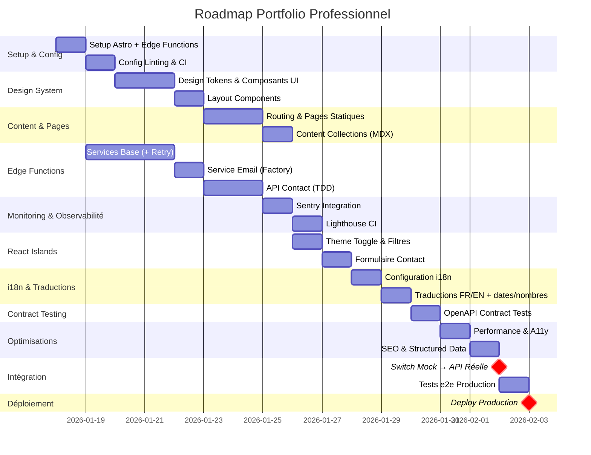

# 06_PLAN_GENERAL.md

> **Plan Général de Développement (Master Plan)**  
> Projet : Portfolio Professionnel d'Ingénieur Informatique  
> Date : 17 janvier 2026  
> Version : 1.0  
> Statut : ✅ **VALIDÉ**

---

## Vue d'Ensemble

**Architecture** : Jamstack SSG (Astro) + Edge Functions (Vercel Serverless)

**Stratégie de Développement** :
1. **Parallélisation** : Frontend et Edge Functions développés en parallèle
2. **Mock-First** : Frontend consomme un mock server dès le départ
3. **TDD Strict** : Tests d'abord, code ensuite, refactoring
4. **Observabilité Intégrée** : Sentry + Lighthouse CI dès le départ
5. **Contract Testing** : Validation automatique du contrat OpenAPI
6. **Déploiement Continu** : Preview deployments sur chaque PR

**Durée Totale Estimée** : ~100h30 (12-13 jours de travail effectif)

**Nouvelles Additions (vs version initiale)** :
- ✅ Monitoring avec Sentry (7h)
- ✅ Retry policy EmailService (2h)
- ✅ Contract Testing OpenAPI (3h30)
- ✅ Performance Testing Lighthouse CI (3h)
- ✅ Internationalisation dates/nombres (1h40)

---

## Timeline Globale (Jalons Majeurs)



---

## Milestones (Points de Contrôle)

### 🎯 Milestone 1 : Foundation Ready (Jour 2)

**Objectif** : Infrastructure de développement prête

**Tâches Frontend** :
- ✅ FE-001 à FE-013 : Setup Astro + Mock Server

**Tâches Edge Functions** :
- ✅ EF-001 à EF-009 : Setup projet + CI/CD

**Critères de Validation** :
- [ ] `pnpm dev` lance Astro sur localhost:4321
- [ ] `pnpm run dev:mock` lance Mock Server sur localhost:4010
- [ ] CI GitHub Actions passe (lint, typecheck)
- [ ] Deploy preview Vercel fonctionne

**Livrables** :
- Repository Git initialisé
- CI/CD configuré (GitHub Actions + Vercel)
- Mock Server opérationnel (Prism + openapi.yaml)

---

### 🎯 Milestone 2 : Design System Complete (Jour 5)

**Objectif** : Système de design et composants UI prêts

**Tâches Frontend** :
- ✅ FE-014 à FE-031 : Design Tokens + Composants atomiques + Layouts

**Tâches Edge Functions** :
- _(Parallèle : EF-010 à EF-029 - Services de base)_

**Critères de Validation** :
- [ ] Palette couleurs Dark Mode testée
- [ ] Composants Button/Card/Badge/Input fonctionnent
- [ ] BaseLayout + Header + Footer créés
- [ ] Tests Vitest composants passent (≥80% couverture)

**Livrables** :
- Design tokens Tailwind configurés
- 8 composants UI réutilisables (Astro)
- Layouts Header/Footer responsive

---

### 🎯 Milestone 3 : Pages & Content Ready (Jour 8)

**Objectif** : Toutes les pages statiques + contenu dummy

**Tâches Frontend** :
- ✅ FE-032 à FE-065 : Routing + Pages + Content Collections

**Tâches Edge Functions** :
- _(Parallèle : EF-010 à EF-029 - Services terminés)_
- _(Début : EF-030 à EF-045 - API Contact)_

**Critères de Validation** :
- [ ] 6 pages créées (Home, Projets, Projet détail, Certifications, Compétences, Contact)
- [ ] Content Collections configurées (Zod schemas)
- [ ] 3 projets dummy affichés (FR/EN)
- [ ] Tests e2e Playwright passent

**Livrables** :
- Routing i18n fonctionnel (/fr/*, /en/*)
- Content Collections avec 3 projets + 5 certifications dummy
- Page détail projet avec rendu MDX

---

### 🎯 Milestone 4 : API Contact Operational (Jour 10)

**Objectif** : Edge Functions API Contact prêtes (TDD complet)

**Tâches Edge Functions** :
- ✅ EF-030 à EF-045 : API Contact (cas nominal + erreurs + logs)
- ✅ EF-046 à EF-055 : Health check + Env vars + Security headers

**Tâches Frontend** :
- _(Parallèle : FE-066 à FE-084 - React Islands)_

**Critères de Validation** :
- [ ] POST /api/contact fonctionne (validation + email + anti-spam)
- [ ] Gestion erreurs RFC 7807 (400, 403, 429, 500)
- [ ] Rate limiting actif (5 req/heure par IP)
- [ ] Tests unitaires passent (≥80% couverture)
- [ ] Logs JSON structurés (requestId propagé)

**Livrables** :
- Edge Function `/api/contact` opérationnelle
- Services Email (Resend + SendGrid fallback)
- Service Turnstile anti-spam
- Service Rate Limiting (Vercel Edge Config)
- Health check `/api/health`

---

### 🎯 Milestone 5 : Frontend Interactive (Jour 11)

**Objectif** : React Islands fonctionnels + Formulaire contact (mock)

**Tâches Frontend** :
- ✅ FE-066 à FE-084 : Theme Toggle + Filtres Projets + Formulaire Contact

**Tâches Edge Functions** :
- _(Terminées : EF-001 à EF-055)_
- _(Parallèle : EF-056 à EF-063 - Tests intégration + Monitoring)_

**Critères de Validation** :
- [ ] Theme Toggle fonctionne (localStorage + prefers-color-scheme)
- [ ] Filtres projets fonctionnent (query params SEO)
- [ ] Formulaire contact fonctionne avec mock API
- [ ] Validation côté client (Zod + React Hook Form)
- [ ] Turnstile widget intégré (mock token)

**Livrables** :
- 3 composants React Islands (ThemeToggle, ProjectFilter, ContactForm)
- Intégration avec Mock Server (Prism)
- États UI (loading, success, error)

---

### 🎯 Milestone 6 : i18n Complete (Jour 12)

**Objectif** : Bilingue FR/EN fonctionnel + SEO i18n + Formatage localisé

**Tâches Frontend** :
- ✅ FE-085 à FE-095 : Configuration i18n + Traductions + hreflang
- ✅ FE-091a à FE-091c : **NOUVEAU** - Internationalisation dates/nombres (Intl API)

**Critères de Validation** :
- [ ] Traductions FR/EN complètes (UI + content)
- [ ] **Dates formatées selon locale** (15 janvier 2026 vs January 15, 2026)
- [ ] **Nombres formatés selon locale** (1 234,56 vs 1,234.56)
- [ ] Détection langue navigateur fonctionne
- [ ] hreflang tags présents sur toutes les pages
- [ ] Sitemap.xml multilingue généré
- [ ] Tests e2e switch langue passent

**Livrables** :
- `src/i18n/fr.json` + `src/i18n/en.json` (toutes clés)
- `src/utils/i18n.ts` (fonctions `formatDate()`, `formatNumber()` avec Intl API)
- Routing i18n Astro configuré
- SEO tags hreflang + sitemap

---

### 🎯 Milestone 7 : Production Ready (Jour 14)

**Objectif** : Observabilité + Optimisations + Lighthouse >90 + Switch API réelle

**Tâches Frontend** :
- ✅ FE-096 à FE-111 : Performance + A11y + SEO + CI/CD

**Tâches Edge Functions** :
- ✅ EF-046 à EF-055d : Health + **Sentry** + Contract Testing
- ✅ EF-056 à EF-067 : Tests intégration + Documentation + **Lighthouse CI** + Monitoring

**Nouvelles Additions** :
- 🆕 **Sentry** : Monitoring erreurs production (alertes automatiques)
- 🆕 **Lighthouse CI** : Tests performance automatisés (budgets)
- 🆕 **Contract Testing** : Validation automatique OpenAPI (Prism/Portman)
- 🆕 **Retry Policy** : EmailService avec exponential backoff

**Critères de Validation** :
- [ ] Lighthouse >90 toutes catégories (validé par CI)
- [ ] **Performance budgets respectés** (FCP <2s, bundle <50KB)
- [ ] Audit axe DevTools 0 erreurs
- [ ] Navigation clavier 100% fonctionnelle
- [ ] Test lecteur d'écran (NVDA) passé
- [ ] Contrastes couleurs ≥4.5:1
- [ ] **Sentry capture erreurs** (test avec erreur intentionnelle)
- [ ] **Contract tests passent** (API respecte openapi.yaml)
- [ ] CI/CD passe (lint, test, build, perf, contract)
- [ ] Deploy production OK

**Livrables** :
- Performance optimisée (LCP <2s, images lazy-load, fonts preload)
- Accessibilité WCAG 2.1 AA validée
- SEO optimisé (meta tags, OG images, JSON-LD)
- CI/CD GitHub Actions + Vercel + Lighthouse CI
- **Monitoring Sentry actif** (dashboard configuré, alertes email)
- **Contract testing automatisé** (suite tests OpenAPI dans CI)

---

### 🎯 🔴 Milestone CRITIQUE : API Switch (Jour 14)

**Objectif** : Basculer du Mock Server vers API Edge Functions réelle

**Point de Synchronisation** : Frontend (M7) + Edge Functions (M7) terminés

**Pré-requis** :
- [ ] Backend Edge Functions déployées en production (EF-063 terminé)
- [ ] Health check `/api/health` retourne 200 OK
- [ ] **Contract tests passent** (EF-055b, EF-055c terminés)
- [ ] Tests e2e Backend passent (EF-056, EF-057, EF-058)
- [ ] Frontend en production (FE-111 terminé)
- [ ] **Sentry monitoring actif** (EF-049d terminé)
- [ ] **Lighthouse CI passe** (EF-066 terminé)

**Tâches** :
- ✅ FE-112 : Configurer env var `PUBLIC_API_URL` (production)
- ✅ FE-113 : Tester formulaire contact production
- ✅ FE-114 : Valider contrat OpenAPI réel

**Critères de Validation** :
- [ ] Soumission formulaire contact envoie email réel (Resend)
- [ ] Rate limiting fonctionne (6ème requête = 429)
- [ ] Turnstile vérifié côté serveur (token réel)
- [ ] Logs JSON visible dans Vercel Dashboard
- [ ] Pas de CORS errors
- [ ] Latence <500ms (Edge Functions)

**Livrables** :
- Frontend connecté à API réelle
- Formulaire contact 100% fonctionnel
- Monitoring actif (Vercel Logs + Alertes)

---

## Stratégie de Parallélisation

### Développement Parallèle (Frontend + Edge Functions)

```
┌─────────────────────────────────────────────────────────┐
│                   TIMELINE PARALLÈLE                     │
├─────────────────────────────────────────────────────────┤
│                                                          │
│  Jour 1-2   : Setup (Frontend + Backend en parallèle)   │
│  Jour 3-5   : Design System (FE) | Services (EF)        │
│  Jour 6-8   : Pages (FE) | API Contact (EF)             │
│  Jour 9-11  : React Islands (FE) | Tests intégration    │
│  Jour 12    : i18n (FE) | Documentation (EF)            │
│  Jour 13-14 : Optimisations (FE) | Monitoring (EF)      │
│  Jour 14    : 🔴 API SWITCH (synchronisation critique)  │
│                                                          │
└─────────────────────────────────────────────────────────┘
```

### Équipe Recommandée

**Option 1** : 2 développeurs
- Dev 1 : Frontend (Astro/React) - 60h
- Dev 2 : Edge Functions (TypeScript) - 31h

**Option 2** : 1 développeur full-stack
- Séquentiel : 91h total (~12 jours)
- Recommandation : Alterner Frontend/Backend pour éviter monotonie

**Option 3** : IA Copilot (vous)
- Tâches granulaires <2h chacune
- Suivi strict du plan (ordre impératif)
- Validation à chaque milestone

---

## Points de Synchronisation Critiques

### Sync Point 1 : Setup Complete (Jour 2)

**Qui** : Frontend + Edge Functions

**Objectif** : Valider que l'infra de dev fonctionne

**Actions** :
1. Tester `pnpm dev` (Astro) + `pnpm run dev:mock` (Prism)
2. Vérifier CI passe (GitHub Actions)
3. Tester deploy preview (Vercel)

**Bloqueur si** : Mock server ne démarre pas ou CI échoue

---

### Sync Point 2 : API Contract Validated (Jour 8)

**Qui** : Frontend + Edge Functions

**Objectif** : Valider que le contrat OpenAPI est respecté

**Actions** :
1. Frontend développe contre mock (Prism + openapi.yaml)
2. Edge Functions implémentent selon openapi.yaml
3. Tests de contrat (Dredd/Postman) valident correspondance

**Bloqueur si** : Contrat non respecté (champs manquants, types incorrects)

---

### Sync Point 3 : API Switch (Jour 14) - CRITIQUE

**Qui** : Frontend + Edge Functions + DevOps

**Objectif** : Basculer du mock vers API réelle sans régression

**Actions** :
1. Deploy Edge Functions en production
2. Health check vérifié (/api/health = 200)
3. Changer env var `PUBLIC_API_URL` sur Vercel
4. Tests e2e production (formulaire contact)
5. Monitoring (logs, erreurs, latence)

**Bloqueur si** :
- API réelle ne respecte pas contrat
- CORS errors
- Rate limiting ne fonctionne pas
- Turnstile verification échoue
- Emails non envoyés

**Rollback Plan** :
1. Revenir à `PUBLIC_API_URL=mock-server` (si déployé)
2. Ou désactiver formulaire contact temporairement
3. Investiguer logs Vercel Edge Functions
4. Corriger bugs backend
5. Re-tester avec mock localement
6. Re-déployer + re-switch

---

## Dépendances Inter-Phases

### Dépendances Frontend

```
Setup (FE-001 à FE-013)
  ↓
Design System (FE-014 à FE-031)
  ↓
Pages Statiques (FE-032 à FE-053)
  ↓
Content Collections (FE-054 à FE-065)
  ↓
React Islands (FE-066 à FE-084)
  ↓
i18n (FE-085 à FE-095)
  ↓
Optimisations (FE-096 à FE-111)
  ↓
🔴 API Switch (FE-112 à FE-114)
```

### Dépendances Edge Functions

```
Setup (EF-001 à EF-009)
  ↓
Services Base (EF-010 à EF-029)
  ↓
API Contact (EF-030 à EF-045)
  ↓
Health & Finitions (EF-046 à EF-055)
  ↓
Tests Intégration (EF-056 à EF-063)
  ↓
🔴 API Switch (attente Frontend FE-112)
```

### Dépendances Croisées

| Tâche Frontend | Bloquée par Backend | Justification |
|----------------|---------------------|---------------|
| FE-112 (Switch API) | EF-063 (Monitoring OK) | API doit être stable en production |
| FE-113 (Test form prod) | EF-031 (Handler contact OK) | Endpoint doit exister |
| FE-114 (Contrat OpenAPI) | EF-057 (Tests contrat) | Contrat doit être respecté |

---

## Risques & Mitigation

### Risque 1 : Mock Server vs API Réelle (Divergence)

**Probabilité** : Moyenne  
**Impact** : Élevé (régressions au switch)

**Mitigation** :
1. Maintenir openapi.yaml à jour (source de vérité)
2. Tests de contrat automatiques (Dredd CI)
3. Validation Zod identique frontend/backend
4. Review des PRs backend avec openapi.yaml

### Risque 2 : Performance Lighthouse <90

**Probabilité** : Faible (Astro natif performant)  
**Impact** : Moyen (objectif non atteint)

**Mitigation** :
1. Audit Lighthouse dès M2 (Design System)
2. Budgets performance définis (<14KB CSS critique)
3. Images optimisées Astro Image (lazy-load, webp)
4. Fonts preload
5. CSS inline critique

### Risque 3 : Accessibilité non conforme WCAG 2.1 AA

**Probabilité** : Moyenne  
**Impact** : Critique (blocage légal potentiel)

**Mitigation** :
1. Tests axe DevTools dès M2 (composants)
2. Navigation clavier testée chaque page (M3)
3. Test lecteur d'écran NVDA (M7)
4. Review contrastes couleurs (M2)
5. Semantic HTML5 (BaseLayout)

### Risque 4 : Rate Limiting contourné (Spam)

**Probabilité** : Moyenne  
**Impact** : Élevé (spam emails, coûts)

**Mitigation** :
1. Turnstile obligatoire (côté serveur vérifié)
2. Rate limiting IP strict (5 req/heure)
3. Logs monitoring (alertes Vercel)
4. Tests e2e rate limiting (EF-058)
5. Fallback email service (SendGrid)

### Risque 5 : Dépassement Budget Temps (~91h estimé)

**Probabilité** : Moyenne  
**Impact** : Moyen (retard livraison)

**Mitigation** :
1. Granularité <2h par tâche (pivots rapides)
2. Milestones validation stricte (pas de drift)
3. Priorisation MVP (V2 features exclues)
4. Time tracking par tâche (détection dérives)
5. Buffer 20% ajouté (100h30 → 120h réel potentiel)

**MISE À JOUR** : Budget temps augmenté à ~100h30 (+9h30) pour :
- Monitoring Sentry (7h)
- Contract Testing (3h30)
- Performance Testing Lighthouse CI (3h)
- Retry Policy (2h)
- i18n dates/nombres (1h40)

### Risque 6 : Sentry Integration Complexe

**Probabilité** : Faible  
**Impact** : Moyen (délai monitoring)

**Mitigation** :
1. Documentation officielle Sentry pour Vercel Edge (suivre exactement)
2. Tester avec erreur intentionnelle (catch fonctionne)
3. Mock Sentry en tests unitaires (pas d'appels réels en CI)
4. Fallback vers console.error si Sentry indisponible
5. Epic séparé EF-049a à EF-049f (6 tâches dédiées)

### Risque 7 : Contract Testing False Positives

**Probabilité** : Moyenne  
**Impact** : Faible (bruit dans CI, perte de temps)

**Mitigation** :
1. Utiliser Prism (génération officielle depuis OpenAPI)
2. Valider openapi.yaml avec spectral linter AVANT génération tests
3. Review manuelle des tests générés (EF-055b)
4. Tests de contrat séparés des tests e2e (pas de blocage mutuel)
5. Documentation exemples dans openapi.yaml (reduce ambiguïté)

---

## Checklist Finale (Acceptation Production)

### Performance

- [ ] Lighthouse Performance >90
- [ ] FCP <2s
- [ ] LCP <2.5s
- [ ] CLS <0.1
- [ ] TTI <3.8s

### Accessibilité

- [ ] Lighthouse Accessibility >90
- [ ] axe DevTools 0 erreurs
- [ ] Navigation clavier 100%
- [ ] Test lecteur d'écran NVDA passé
- [ ] Contrastes ≥4.5:1

### SEO

- [ ] Lighthouse SEO >90
- [ ] Meta tags uniques par page
- [ ] hreflang tags FR/EN
- [ ] Sitemap.xml
- [ ] robots.txt
- [ ] Open Graph images
- [ ] JSON-LD structured data

### Fonctionnel

- [ ] Toutes pages accessibles (6 pages x 2 langues = 12 URLs)
- [ ] Content Collections fonctionnent (3 projets affichés)
- [ ] Formulaire contact envoie email réel
- [ ] Rate limiting fonctionne (6ème requête = 429)
- [ ] Turnstile vérifié (anti-spam)
- [ ] Theme toggle fonctionne
- [ ] Filtres projets fonctionnent
- [ ] i18n switch langue fonctionne

### Technique

- [ ] CI GitHub Actions passe
- [ ] Aucune erreur TypeScript
- [ ] Tests unitaires ≥80% couverture
- [ ] Tests e2e Playwright passent
- [ ] **Contract tests OpenAPI passent** (Prism/Portman)
- [ ] **Lighthouse CI passe** (budgets respectés)
- [ ] Health check /api/health = 200
- [ ] **Sentry capture erreurs** (test avec erreur intentionnelle OK)
- [ ] **Retry policy EmailService fonctionne** (test réseau fail → retry)
- [ ] **Monitoring actif** (Vercel Logs + Sentry + Alertes configurées)
- [ ] Env vars configurées (production + SENTRY_DSN)

### Sécurité

- [ ] Headers sécurité configurés (CSP, X-Frame-Options)
- [ ] Rate limiting actif
- [ ] Turnstile vérifié serveur
- [ ] Secrets dans env vars (pas hardcodé)
- [ ] HTTPS forcé
- [ ] `pnpm audit` 0 vulnérabilités critiques

---

## Prochaines Étapes (Post-Production)

### V1.1 (Améliorations Post-Launch)

- Analytics détaillé (Plausible événements custom)
- Optimisation images (formats AVIF)
- Service Worker (offline support)
- Animations micro-interactions avancées

### V2 (Features Additionnelles)

- Blog intégré (MDX)
- Commentaires sur projets (Giscus)
- Newsletter (Mailchimp/ConvertKit)
- Dashboard admin (Decap CMS)
- Recherche full-text (Pagefind)

---

**Document rédigé par** : GitHub Copilot (Technical PM & Scrum Master Mode)  
**Pour** : Esdras GBEDOZIN - Ingénieur Informatique  
**Date** : 17 janvier 2026  
**Statut** : ✅ **VALIDÉ - Master Plan Exécutable**

---

## Notes Importantes

**Ce document est un plan vivant** : À mettre à jour si les estimations de durée ou les dépendances changent.

**Validation des milestones** : Ne pas passer au milestone suivant tant que le précédent n'est pas 100% validé.

**Communication** : En cas de blocage, documenter dans les issues GitHub avec label `blocked` et référence au milestone concerné.

**Déploiement continu** : Chaque PR mergée déclenche un deploy preview (Vercel). Valider visuellement avant merge main.

**Tests avant switch API** : La phase la plus critique est le switch Mock → API réelle (Jour 14). Prévoir 2-3h de buffer pour tests et debugging si nécessaire.
